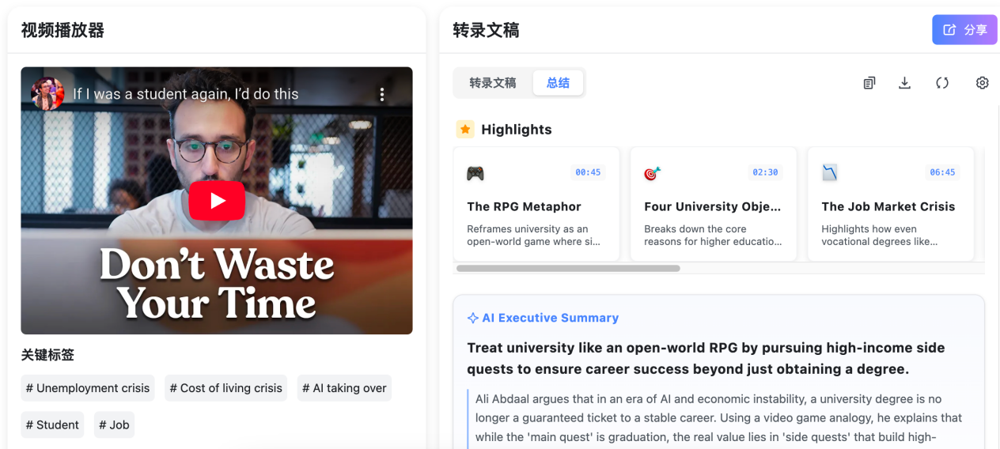
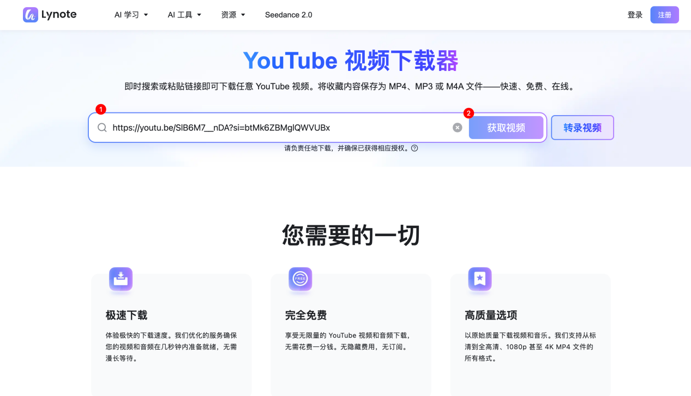
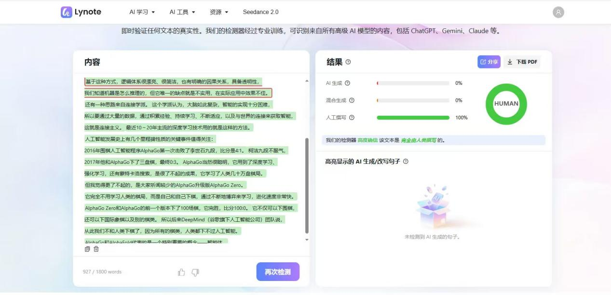

  <a href="README.md">🇺🇸 English</a> | <a href="README_CN.md">🇨🇳 中文</a>

  

<h1 align="center">Lynote</h1>

  <b>Free All-in-One AI Toolkit for Learning & Productivity</b>

  <a href="https://lynote.ai/">🌐 Website</a> •
  <a href="https://lynote.ai/youtube-transcript">📝 Transcript</a> •
  <a href="https://lynote.ai/youtube-summary">📊 Summary</a> •
  <a href="https://lynote.ai/ai-detector">🔍 AI Detector</a> •
  <a href="https://lynote.ai/ai-humanizer">✍️ Humanizer</a> •
  <a href="https://lynote.ai/ai-translator">🌍 Translator</a>

## What is Lynote?

Lynote is a completely **free**, all-in-one AI-powered platform for learning and productivity. No registration required, no hidden fees — just paste a link or your text and get started instantly.

Whether you're a student digesting YouTube lectures, a researcher polishing papers, or a content creator producing original work, Lynote replaces multiple expensive subscriptions with one unified toolkit.

🔗 **Try it now:** [https://lynote.ai](https://lynote.ai/)

## ✨ Features

| Category | Feature | Description |
|----------|---------|-------------|
| 🎬 **AI Work** | [YouTube Transcript](https://lynote.ai/youtube-transcript) | Auto-generate timestamped transcripts with smart chapters in 100+ languages |
| 🎬 **AI Work** | [YouTube Summary](https://lynote.ai/youtube-summary) | Visual AI summaries with key video snapshots, mind maps & action steps |
| 🎬 **AI Work** | [YouTube Downloader](https://lynote.ai/youtube-downloader) | Download YouTube videos & audio in 1080p / 4K, multiple formats |
| 📚 **AI Learning** | [AI Detector](https://lynote.ai/ai-detector) | Detect AI-generated content with 99% accuracy, supports 80+ languages |
| 📚 **AI Learning** | [AI Humanizer](https://lynote.ai/ai-humanizer) | Rewrite AI text to sound natural and bypass detection tools |
| 📚 **AI Learning** | [AI Translator](https://lynote.ai/ai-translator) | Context-aware translation across 100+ languages |

## 🎬 AI Work Tools

### YouTube Transcript

Powered by AI keyword analysis, Lynote generates word-by-word transcripts with smart chapters and precise timestamps in seconds. Supports 100+ languages.

- 🕐 Jump directly to any section via timestamps
- 📋 One-click copy or export transcript
- 🧩 Free Chrome extension for in-page use while watching videos
- 💰 100% free, unlimited usage, no registration
- 

  

### YouTube Summary

Unlike tools that only output plain text, Lynote combines AI summaries with key video snapshots (slides, charts, code screens) to create visual study notes.

- 🖼️ Auto-captures key frames from the video
- 📝 Breaks down tutorials into actionable step-by-step checklists
- 🧠 One-click export as mind map
- 💰 100% free, unlimited usage, no registration

### YouTube Downloader

Fast downloads with support for multiple resolutions and formats.

- 📺 Supports 1080p, Full HD, and 4K
- 🎵 Download video or audio only
- 💰 100% free, unlimited usage, no registration

  

- ## 📚 AI Learning Tools

### AI Detector

Instantly scan content generated by ChatGPT, Claude, Gemini, and other AI models. Pinpoints specific AI-generated sentences with highlighting.

- ⚡ Instant scanning speed
- 🎯 99% accuracy, industry-leading level
- 🌍 Supports 80+ languages and long-form text
- 💰 20 free scans per day

  

 

### AI Humanizer

Transform robotic AI text into natural, human-sounding writing while preserving the original meaning. One-click operation, no complex prompts needed.

- 🤖→🧑 Adjusts sentence structure and adds human expression patterns
- ✅ Output passes major AI detection tools
- 💰 Free to use

### AI Translator

Go beyond word-by-word translation. Lynote's deep learning model delivers context-aware, natural translations that preserve nuance and meaning.

- 🌍 Supports 100+ languages
- 🎓 Handles academic terminology and colloquial expressions
- 💰 Free to use

- ## 🚀 Why Lynote?

| Pain Point | Old Way | Lynote Way |
|-----------|---------|------------|
| YouTube transcript tools | $15+/month subscription | ✅ Free, unlimited |
| AI summary + translation | Multiple paid plugins | ✅ All-in-one, free |
| AI content detection | Pay-per-scan pricing | ✅ 20 free scans/day |
| Tool switching fatigue | Jump between 4-5 apps | ✅ One platform does it all |

**Lynote = YouTube Transcript + YouTube Summary + YouTube Downloader + AI Detector + AI Humanizer + AI Translator — all free, all in one place.**

## 🔗 Quick Links

- 🌐 **Website:** [https://lynote.ai](https://lynote.ai/)
- 📝 **YouTube Transcript:** [https://lynote.ai/youtube-transcript](https://lynote.ai/youtube-transcript)
- 📊 **YouTube Summary:** [https://lynote.ai/youtube-summary](https://lynote.ai/youtube-summary)
- 📥 **YouTube Downloader:** [https://lynote.ai/youtube-downloader](https://lynote.ai/youtube-downloader)
- 🔍 **AI Detector:** [https://lynote.ai/ai-detector](https://lynote.ai/ai-detector)
- ✍️ **AI Humanizer:** [https://lynote.ai/ai-humanizer](https://lynote.ai/ai-humanizer)
- 🌍 **AI Translator:** [https://lynote.ai/ai-translator](https://lynote.ai/ai-translator)

## 📄 License

This project is licensed under the [MIT License](LICENSE).

---

  Made with ❤️ by the <a href="https://lynote.ai">Lynote</a> team

